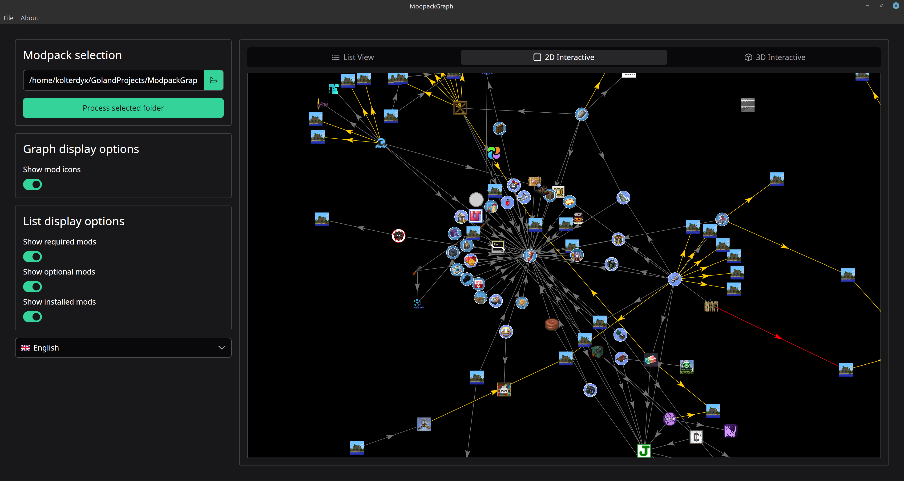
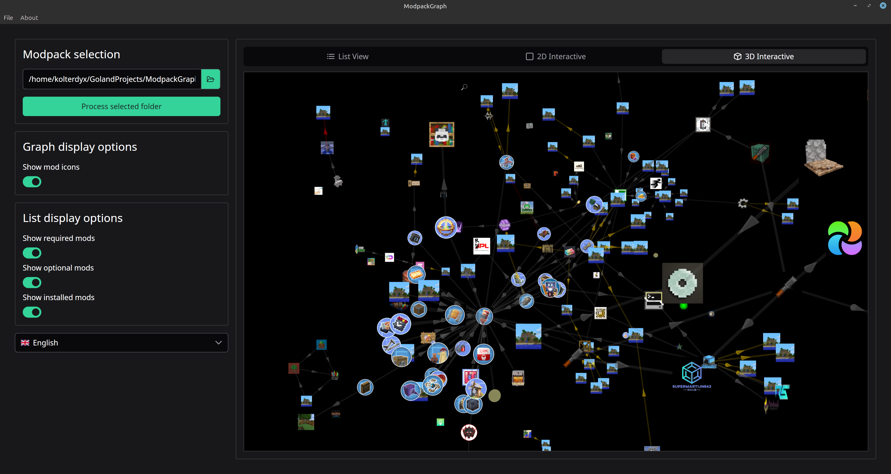
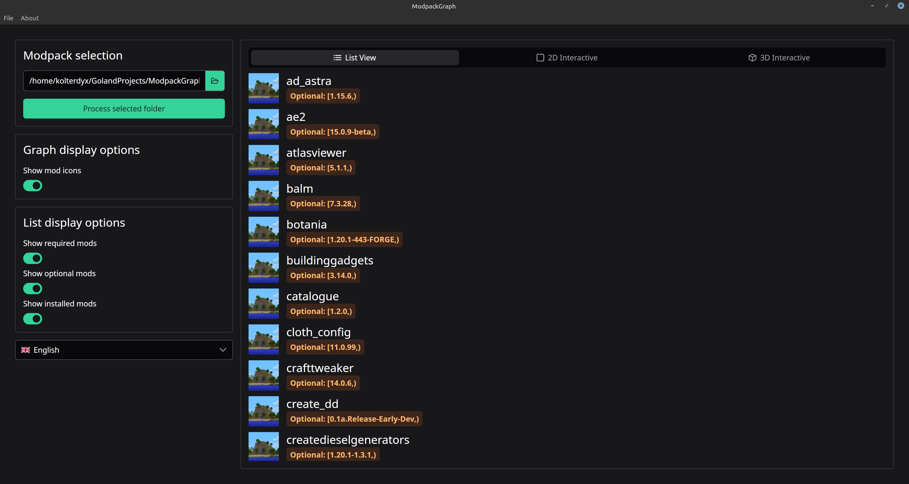

# ModpackGraph

ModpackGraph is a tool designed to visualize and analyze the dependencies and relationships within Minecraft modpacks.

## Features
- 2D Visual representation of mod dependencies
- 3D Visual representation of mod dependencies
- List of all mods in the modpack, and their missing dependencies

## Installation

You can download an installer or a portable version from the [Releases](https://github.com/Kolterdyx/ModpackGraph/releases/latest) page.
Currently, only Windows and Linux are supported.

## Screenshots

